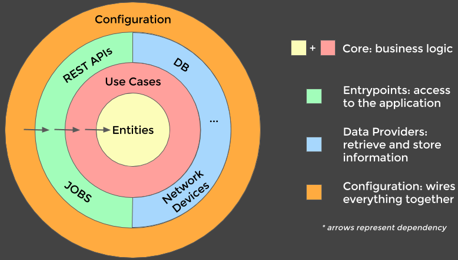

# F# Scrum onion architecture sample

*Got a comment or a question? Don't hesitate to drop me an email or open an issue.*

This sample focuses on applying functional constructs over cluing together
libraries and frameworks. It substitutes .NET dependency injection container,
FluentValidation, MediatR, Entity Framework, Moq, Respawn, and a migration tool
for custom constructs.

It's imperative shell, functional core illustrated.



The sample is a modular monolith which offers the simplicity of a monolith and
the scalability of microservices.

It includes the following features:

- Vertical slice architecture, with Story being the only slice.
- REST API adhering to the [Zalando API
guidelines](https://opensource.zalando.com/restful-api-guidelines/) with JWTs
supporting role-based security.
- A simple identity provider to issue, renew, and inspect JWTs accepted by the
  REST API.
- Command Query Responsibility Segregation (CQRS) access to the application
  layer.
- Paged responses for endpoints which return collections.
- Integration tests with the ability to fake any dependency.
- Database migrations and initial seeding.
- ASP.NET health checks for memory and database.
- k6 load test with baseline under `tests/k6`.
- Architecture decision records under `docs/architecture-decision-records`.

## Context

The Scrum domain was chosen because everyone is familiar with it, though most
aspects of the application is illustrated with stories and tasks only. Onion
architecture and domain driven design may therefore seem to introduce a
disproportional amount of complexity. In practice, they're only worth it for
larger, more complex domains with more integrations.

Not every project requires an implementation of every concept from onion
architecture and domain driven design. Concepts should be scaled up or down
based on business complexity and expected evolution of the application: if core
is expected to only ever be accessed through the web service, code from core
handlers could be moved to HTTP handlers. On the other hand, if core is to be
exposed through multiple of web, gRPC, console, or a long-running service, the
extra indirection with core handlers becomes valuable.

The sample constraints itself to The Blue Book concepts. That means implementing
CQRS, aggregates, entities, domain events, and so on. For the HTTP API, the
sample adheres to the Zalando API guidelines. It doesn't mean The Blue Book and
the Zalando API guidelines are the end all, be all, but the sample strives to
reflect constraints of a larger real-world application.

## Getting started

Running the tests or the web app creates the SQLite databases in the Git root as
`scrum_web.sqlite` and `scrum_test.sqlite`.

    $ dotnet tool restore
    $ dotnet build
    $ dotnet test
    $ dotnet run --project src/Scrum

Opening the Git repository with VSCode will make it pick up the DevContainer
configuration.

## Operations

```bash
# Authentication (supported roles: member and/or admin)
## Post
curl "https://localhost:5000/authentication/issue-token?userId=1&roles=member,admin" --insecure --request POST
curl https://localhost:5000/authentication/renew-token --insecure --request POST -H "Authorization: Bearer <token>"
curl https://localhost:5000/authentication/introspect --insecure --request POST -H "Authorization: Bearer <token>"

# Stories
## Post
curl https://localhost:5000/stories --insecure --request POST -H 'Content-Type: application/json' -H 'Authorization: Bearer <token>' -d '{"title": "title", "description": "description"}'
curl https://localhost:5000/stories/<storyId>/tasks --insecure --request POST -H 'Content-Type: application/json' -H 'Authorization: Bearer <token>' -d '{"title": "title","description": "description"}'

## Put
curl https://localhost:5000/stories/<storyId> --insecure --request PUT -H 'Content-Type: application/json' -H 'Authorization: Bearer <token>' -d '{"title": "title1","description": "description1"}'
curl https://localhost:5000/stories/<storyId>/tasks/<taskId> --insecure --request PUT -H 'Content-Type: application/json' -H 'Authorization: Bearer <token>' -d '{"title": "title1","description": "description1"}'

## Delete
curl https://localhost:5000/stories/<storyId>/tasks/<taskId> --insecure --request DELETE -H 'Authorization: Bearer <token>'
curl https://localhost:5000/stories/<storyId> --insecure --request DELETE -H 'Authorization: Bearer <token>'

## Get
curl https://localhost:5000/stories/<storyId> --insecure -H 'Authorization: Bearer <token>'
curl "https://localhost:5000/stories?limit=<limit>&cursor=<cursor>" --insecure -H 'Authorization: Bearer <token>'

# PersistedDomainEvents
## Get
curl "https://localhost:5000/persisted-domain-events/<aggregateId>?limit=<limit>&cursor=<cursor>" --insecure -H 'Authorization: Bearer <token>'

# Health
## Get
curl https://localhost:5000/health --insecure
```

## Reflections

The onion architecture is good at separating functionality into testable layers,
more so than the classic three-layer architecture, but at the cost of ceremony:

- Mapping logic is needed at each layer, such as DTO to/from domain, database
  to/from domain, and value types to wrap primitive types.
- Re-implementation of a request pipeline in Application layer rather than
  re-using what ASP.NET offers out of the box. It enables the Application layer
  to be re-used across ASP.NET, console, or service hosts, but sometimes those
  hosts might internally go through the HTTP interface.
- Using a document database could alleviate a lot of complex, repetitive mapping
  in repositories. Like
  [PostgreSQL](https://www.postgresql.org/docs/current/functions-json.html),
  such database should support queries/indices on JSON documents. Alternatively,
  queries on separate read model projections as relational tables or JSON
  documents. At this point, looking into [Marten](https://martendb.io) and
  [Wolverine](https://wolverinefx.net) may be preferred over home grown
  solutions.
- F#'s type system is superior to C#'s, but increased compile times make F# less
  attractive. A 2.5 kloc codebase shouldn't take 15-20 seconds to compile. By
  copying `Story.fs` and updating the namespaces, we can extrapolate that a 10
  kloc codebase would have a 1+ minute compile time.
- The actor model, implemented by something like
  [Orleans](https://learn.microsoft.com/en-us/dotnet/orleans), would be
  well-suited for applications where the same aggregate is often requested (as
  actors are stateful). Each aggregate becomes an actor with commands and
  queries becoming actor methods. Inside each method would be command/query
  handler code and Orleans would serve as mediator with its request pipeline. In
  principle, an actor framework could replay events and generate projections,
  though switching to a document database and a non-actor approach, the
  stateless Application layer may be performant enough.

## See also

- [Implementing Domain-Driven Design by Vaughn Vernon (The Blue Book)](https://www.amazon.com/Implementing-Domain-Driven-Design-Vaughn-Vernon/dp/0321834577).
- [Domain Modeling Made Functional: Tackle Software Complexity with Domain-Driven Design and F# by Scott Wlaschin](https://www.amazon.com/Domain-Modeling-Made-Functional-Domain-Driven/dp/1680502549).
- [Jason Taylor's C# Clean Architecture Solution Template](https://github.com/jasontaylrdev/CleanArchitecture).
- [Uncle Bob: Architecture the Lost Years](https://www.youtube.com/watch?v=WpkDN78P884).
- [.NET Microservices: Architecture for Containerized .NET Applications](https://docs.microsoft.com/en-us/dotnet/architecture/microservices), specifically the chapter on [Tackling Business Complexity in a Microservice with DDD and CQRS Patterns](https://docs.microsoft.com/en-us/dotnet/architecture/microservices/microservice-ddd-cqrs-patterns).
- [F# units of measure for primitive non-numeric types](https://github.com/fsprojects/FSharp.UMX).
- [Jeremy Miller: Thoughts on Code Organization in a Post-Hexagonal World](https://jeremydmiller.com/2023/08/08/thoughts-on-code-organization-in-a-post-hexagonal-world).
- [Jeremy Miller: Efficient Web Services with Marten V4](https://jeremydmiller.com/2021/09/28/efficient-web-services-with-marten-v4).
